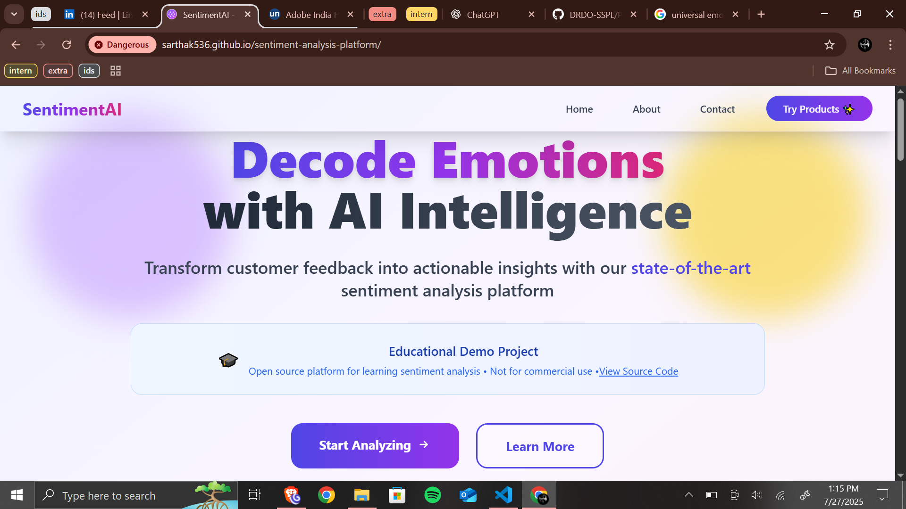
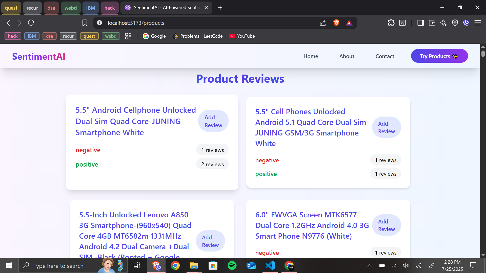
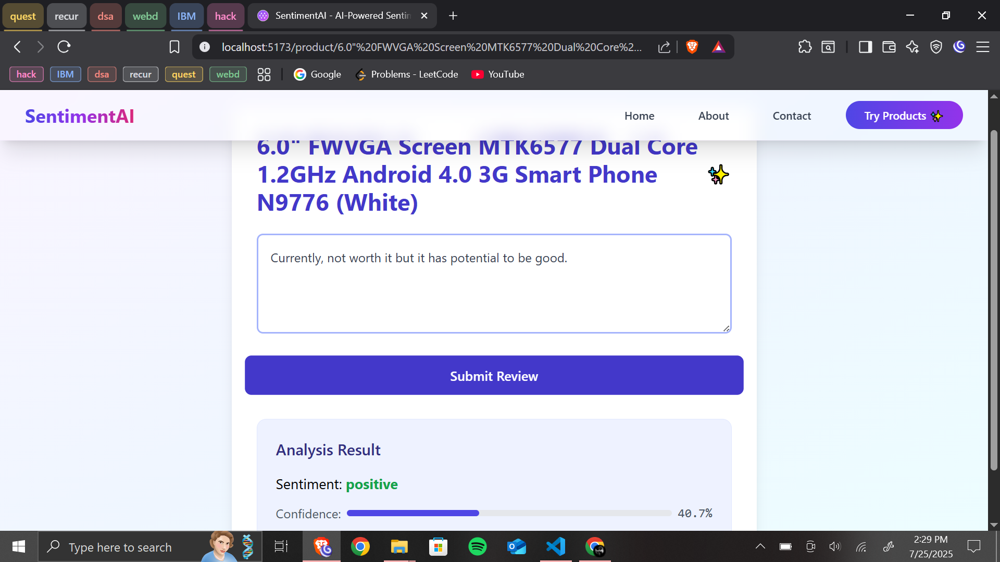

# 🤖 SentimentAI - AI-Powered Sentiment Analysis Platform

<div align="center">


[](https://reactjs.org/)
[](https://vitejs.dev/)
[](https://flask.palletsprojects.com/)
[](https://python.org/)
[](https://tailwindcss.com/)

*Transform customer feedback into actionable insights with cutting-edge AI technology*

**🔗 [Live Demo](https://sarthak536.github.io/sentiment-analysis-platform/)** • [📖 Documentation](#-features) • [🛠️ Installation](#️-installation) • [🤝 Contributing](#-contributing)

</div>

---

## 🚀 Live Demo

**Experience SentimentAI in action:** [https://sarthak536.github.io/sentiment-analysis-platform/](https://sarthak536.github.io/sentiment-analysis-platform/)

> ℹ️ **Demo Mode**: The live demo runs in demonstration mode with keyword-based sentiment analysis. For full ML capabilities, see the [Backend Setup](#backend-setup) section.

---

## 🎮 Try It Now!

<div align="center">

[](https://sarthak536.github.io/sentiment-analysis-platform/)

**✨ Experience the full sentiment analysis platform instantly!**

*No installation required • Works in your browser • Fully responsive design*

</div>

---

## 🌟 Overview

**SentimentAI** is a modern, full-stack sentiment analysis platform that leverages advanced natural language processing to analyze customer reviews and feedback. Built with React and Flask, it provides real-time sentiment detection with beautiful visualizations and an intuitive user interface.

### ✨ Key Highlights

- 🧠 **Advanced AI Models** - State-of-the-art transformer models for accurate sentiment detection
- ⚡ **Real-time Processing** - Instant analysis with <100ms response time
- 🎨 **Modern UI/UX** - Beautiful, responsive design with Tailwind CSS
- 📊 **Interactive Dashboard** - Comprehensive analytics and visualizations
- 🔄 **Demo Mode** - Functional demo without backend dependencies

---

## 🎯 Features

### 🤖 **AI-Powered Analysis**
- **Multi-model Support**: BERT, RoBERTa, and custom transformer models
- **Context Understanding**: Detects sarcasm, nuance, and complex emotions
- **English Language Focus**: Optimized for English text analysis with high accuracy
- **Confidence Scoring**: Detailed accuracy metrics for each prediction

### 🚀 **Modern Architecture**
- **React 19.1.0**: Latest React features with modern hooks and context
- **Vite Build Tool**: Lightning-fast development and optimized production builds
- **Tailwind CSS**: Utility-first styling with responsive design
- **Flask API**: Lightweight Python backend with RESTful endpoints

### 📊 **Analytics & Insights**
- **Real-time Dashboard**: Live sentiment tracking and analytics
- **Historical Data**: Trend analysis and sentiment evolution over time
- **Export Capabilities**: Download results in multiple formats (CSV, JSON, PDF)
- **Visualization Tools**: Interactive charts and graphs powered by modern libraries

### 🔒 **Enterprise Ready**
- **Secure API**: Authentication and rate limiting for production use
- **Database Integration**: PostgreSQL support for data persistence
- **Environment Configuration**: Flexible deployment with environment variables
- **Docker Support**: Containerized deployment for any environment

---

## 📸 Screenshots

<div align="center">
  
  
  
</div>

---

## 🛠️ Installation

### Quick Start (Frontend Only - Demo Mode)

```bash
# Clone repository
git clone https://github.com/sarthak536/sentiment-analysis-platform.git
cd sentiment-analysis-platform

# Setup frontend
cd sentiment_frontend
npm install
npm run dev
```

### Full Stack Setup

#### Prerequisites
- **Node.js** 18+ and npm
- **Python** 3.10+ and pip
- **PostgreSQL** (optional, for database features)

#### Backend Setup
```bash
# Navigate to backend directory
cd sentiment_backend

# Create virtual environment
python -m venv sentiment_env

# Activate virtual environment
# Windows:
sentiment_env\Scripts\activate
# macOS/Linux:
source sentiment_env/bin/activate

# Install dependencies
pip install -r requirements.txt

# Configure environment variables
cp .env.example .env
# Edit .env with your database credentials

# Run Flask server
python app.py
```

#### Frontend Setup
```bash
# Navigate to frontend directory
cd sentiment_frontend

# Install dependencies
npm install

# Start development server
npm run dev
```

Access the application at `http://localhost:5173`

---

## 🔧 Configuration

### Environment Variables

Create a `.env` file in the `sentiment_backend` directory:

```env
# Database Configuration
DB_HOST=localhost
DB_NAME=sentiment_db
DB_USER=sentiment_user
DB_PASSWORD=your_secure_password
DB_PORT=5432

# Flask Configuration
FLASK_ENV=development
SECRET_KEY=your_secret_key_here

# ML Model Configuration
MODEL_NAME=cardiffnlp/twitter-roberta-base-sentiment
CACHE_DIR=./model_cache
```

### Database Setup (Optional)

```sql
-- Create database and user
CREATE DATABASE sentiment_db;
CREATE USER sentiment_user WITH PASSWORD 'your_secure_password';
GRANT ALL PRIVILEGES ON DATABASE sentiment_db TO sentiment_user;
```

---

## 🚀 Deployment

### Frontend Deployment (GitHub Pages)
1. Fork this repository
2. Enable GitHub Pages in repository settings
3. Select "GitHub Actions" as deployment source
4. Push to main branch - automatic deployment via GitHub Actions

### Full Stack Deployment

#### Using Docker
```bash
# Build and run with docker-compose
docker-compose up --build

# Access application
# Frontend: http://localhost:3000
# Backend API: http://localhost:5000
```

#### Manual Deployment
- **Frontend**: Deploy to Netlify, Vercel, or GitHub Pages
- **Backend**: Deploy to Heroku, AWS, or DigitalOcean
- **Database**: Use managed PostgreSQL (AWS RDS, Google Cloud SQL)

---

## 📋 API Documentation

### Analyze Sentiment
```http
POST /analyze
Content-Type: application/json

{
  "product_type": "Samsung Galaxy S21",
  "review": "This phone is absolutely amazing! Great camera quality."
}
```

**Response:**
```json
{
  "sentiment": "positive",
  "score": 0.9234,
  "confidence": "high",
  "processing_time": "0.045s"
}
```

### Get Summary Statistics
```http
GET /summary
```

**Response:**
```json
{
  "data": {
    "iPhone 13": {
      "positive": 30,
      "negative": 2,
      "neutral": 8
    },
    "Samsung Galaxy S21": {
      "positive": 25,
      "negative": 5,
      "neutral": 10
    }
  }
}
```

---

## 🧪 Testing

```bash
# Run backend tests
cd sentiment_backend
python -m pytest tests/

# Run frontend tests
cd sentiment_frontend
npm run test

# Run integration tests
npm run test:integration
```

---

## 🤝 Contributing

We welcome contributions! Please follow these steps:

1. **Fork** the repository
2. **Create** a feature branch (`git checkout -b feature/amazing-feature`)
3. **Commit** your changes (`git commit -m 'Add amazing feature'`)
4. **Push** to the branch (`git push origin feature/amazing-feature`)
5. **Open** a Pull Request

### Development Guidelines
- Follow PEP 8 for Python code
- Use ESLint configuration for JavaScript/React
- Write tests for new features
- Update documentation as needed

---

## 📊 Project Statistics

- **Languages**: JavaScript, Python, CSS, HTML
- **Frameworks**: React, Flask, Tailwind CSS
- **ML Libraries**: Transformers, PyTorch, Scikit-learn
- **Database**: PostgreSQL
- **Deployment**: GitHub Pages, Docker

---

## 📄 License

This project is licensed under the MIT License - see the [LICENSE](LICENSE) file for details.

---

## 🙏 Acknowledgments

- **Hugging Face** for providing pre-trained transformer models
- **Cardiff NLP** for the Twitter RoBERTa sentiment model
- **React Team** for the amazing frontend framework
- **Tailwind CSS** for the utility-first CSS framework

---

## 📞 Contact

**Sarthak Goel**
- 📧 Email: sarthakgoel534@gmail.com
- 🔗 GitHub: [@sarthak536](https://github.com/sarthak536)
- 💼 LinkedIn: [Sarthak Goel](https://www.linkedin.com/in/sarthak-goel-/)

---

<div align="center">

**⭐ Star this repository if you found it helpful!**

[](https://github.com/sarthak536/sentiment-analysis-platform/stargazers)

Made with ❤️ by [Sarthak Goel](https://github.com/sarthak536)

</div>
