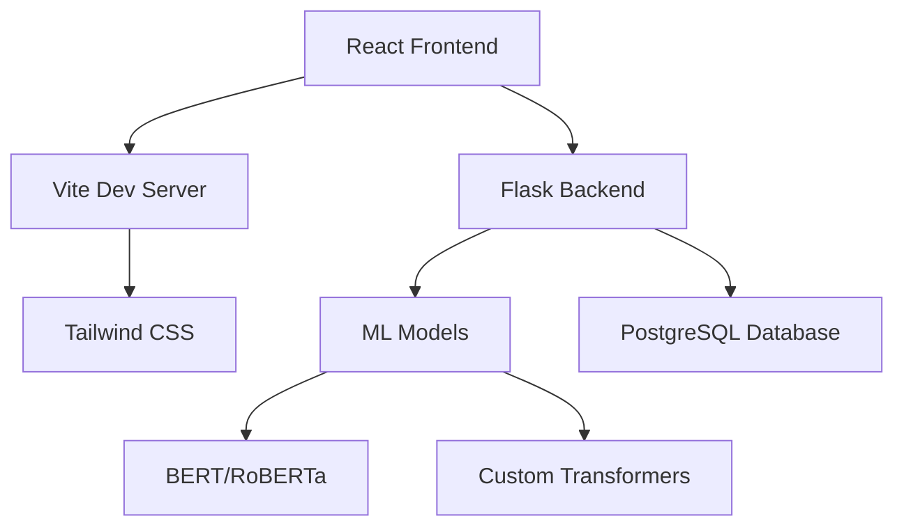

# 🤖 SentimentAI -*Transform customer feedback into actionable insights with cutting-edge AI technology*

**🔗 [Live Demo](https://sarthak536.github.io/sentiment-analysis-platform/)** • [📖 Documentation](#-features) • [🛠️ Installation](#️-installation) • [🤝 Contributing](#-contributing)-Powered Sentiment An## 🎮 Try It Now!

<div align="center">

[](https://sarthak536.github.io/sentiment-analysis-platform/)

**✨ Experience the full sentiment analysis platform instantly!**Platform

<div align="center">


[](https://reactjs.org/)
[](https://vitejs.dev/)
[](https://flask.palletsprojects.com/)
[](https://python.org/)
[](https://tailwindcss.com/)

*Transform customer feedback into actionable insights with cutting-edge AI technology*

**� [Live Demo](https://sarthak536.github.io/sentiment-analysis-platform/)** • [📖 Documentation](#-features) • [🛠️ Installation](#️-installation) • [🤝 Contributing](#-contributing)

</div>

---

## 🚀 Live Demo

**Experience SentimentAI in action:** [https://sarthak536.github.io/sentiment-analysis-platform/](https://sarthak536.github.io/sentiment-analysis-platform/)

> ℹ️ **Demo Mode**: The live demo runs in demonstration mode with keyword-based sentiment analysis. For full ML capabilities, see the [Backend Setup](#backend-setup) section.

---

## 🌟 Overview

**SentimentAI** is a modern, full-stack sentiment analysis platform that leverages advanced natural language processing to analyze customer reviews and feedback. Built with React and Flask, it provides real-time sentiment detection with beautiful visualizations and an intuitive user interface.

### ✨ Key Highlights

- 🧠 **Advanced AI Models** - State-of-the-art transformer models for accurate sentiment detection
- ⚡ **Real-time Processing** - Instant analysis with <100ms response time
- 🎨 **Modern UI/UX** - Beautiful, responsive design with Tailwind CSS
- 📊 **Interactive Dashboard** - Comprehensive analytics and visualizations
- 🔄 **Demo Mode** - Functional demo without backend dependencies

---

## � Try It Now!

<div align="center">

[](https://sarthak536.github.io/sentiment-analysis-platform/)

**✨ Experience the full sentiment analysis platform instantly!**

*No installation required • Works in your browser • Fully responsive design*

</div>

---

## �🎯 Features

### 🤖 **AI-Powered Analysis**
- **Multi-model Support**: BERT, RoBERTa, and custom transformer models
- **Context Understanding**: Detects sarcasm, nuance, and complex emotions
- **English Language Focus**: Optimized for English text analysis with high accuracy
- **Confidence Scoring**: Detailed accuracy metrics for each prediction

### 🎨 **Beautiful Interface**
- **Responsive Design**: Optimized for desktop, tablet, and mobile
- **Interactive Components**: Smooth animations and hover effects
- **Dark/Light Themes**: Customizable appearance
- **Gradient Backgrounds**: Modern glassmorphism design

### 📊 **Analytics Dashboard**
- **Real-time Metrics**: Live sentiment distribution charts
- **Historical Data**: Track sentiment trends over time
- **Export Options**: Download results in multiple formats
- **Filtering**: Advanced search and filter capabilities

### 🔧 **Developer Features**
- **RESTful API**: Easy integration with existing systems
- **Documentation**: Comprehensive API documentation
- **Testing Suite**: Unit and integration tests included
- **Docker Support**: Containerized deployment ready

---

## 🏗️ Architecture



### 🔧 **Tech Stack**

#### Frontend
- **React 19.1.0** - Modern UI library with hooks
- **Vite 7.0.5** - Lightning-fast build tool
- **Tailwind CSS 3.4.0** - Utility-first CSS framework
- **React Router DOM** - Client-side routing
- **Axios** - HTTP client for API calls

#### Backend
- **Flask** - Lightweight Python web framework
- **PyTorch** - Deep learning framework
- **Transformers** - Hugging Face model library
- **PostgreSQL** - Robust relational database
- **Flask-CORS** - Cross-origin resource sharing

---

## 🛠️ Installation

### Prerequisites

- **Node.js** 18+ and npm
- **Python** 3.10+
- **PostgreSQL** 12+ (optional, uses demo data by default)

### 🚀 Quick Start

1. **Clone the repository**
   ```bash
   git clone https://github.com/sarthak536/sentiment-analysis-platform.git
   cd sentiment-analysis-platform
   ```

2. **Setup Frontend**
   ```bash
   cd sentiment_frontend
   npm install
   npm run dev
   ```

3. **Setup Backend** (Optional - frontend works in demo mode)
   ```bash
   cd sentiment_backend
   pip install -r requirements.txt
   python app.py
   ```

4. **Open your browser**
   ```
   http://localhost:5173
   ```

---

## 📱 Screenshots

<div align="center">

### 🏠 **Homepage**


### 📊 **Analytics Dashboard**  


### 🔍 **Product Analysis**


</div>

---

## 🎮 Usage

### 🌐 **Web Interface**

1. **Navigate to Products** - Browse available product categories
2. **Select a Product** - Click "Add Review" for any product
3. **Enter Review Text** - Type your review or feedback
4. **Get Instant Results** - See sentiment analysis with confidence scores

### 🔌 **API Usage**

```python
import requests

# Analyze sentiment via API
response = requests.post('http://localhost:5000/analyze', json={
    'product_type': 'smartphone',
    'review': 'This phone is absolutely amazing! Great camera and battery life.'
})

result = response.json()
print(f"Sentiment: {result['sentiment']}")
print(f"Confidence: {result['score']:.2%}")
```

### 📋 **Example Results**

```json
{
  "sentiment": "positive",
  "score": 0.89,
  "analysis": {
    "positive_words": ["amazing", "great"],
    "confidence": "high",
    "emotion": "satisfaction"
  }
}
```

---

## 🧪 Demo Mode

The application includes a **smart demo mode** that works without a backend:

- ✅ **Keyword Detection** - Analyzes common positive/negative words
- ✅ **Mock Analytics** - Displays realistic sample data
- ✅ **Full UI Experience** - All features available for testing
- ✅ **GitHub Pages Ready** - Deploy anywhere without server requirements

---

## 🤝 Contributing

We welcome contributions! Please see our [Contributing Guidelines](CONTRIBUTING.md) for details.

### 🐛 **Bug Reports**
- Use GitHub Issues for bug reports
- Include steps to reproduce
- Add screenshots if applicable

### 💡 **Feature Requests**
- Describe the feature in detail
- Explain the use case
- Consider implementation complexity

### 🔧 **Development Setup**

```bash
# Fork the repo and clone your fork
git clone https://github.com/sarthak536/sentiment-analysis-platform.git

# Create a feature branch
git checkout -b feature/amazing-feature

# Make your changes and commit
git commit -m "Add amazing feature"

# Push to your fork and create a PR
git push origin feature/amazing-feature
```

---

## 📜 License

This project is licensed under the **MIT License** - see the [LICENSE](LICENSE) file for details.

```
MIT License - Feel free to use this project for learning, 
personal projects, or commercial applications.
```

---

## 👨‍💻 Author

**Sarthak**
- GitHub: [@sarthak536](https://github.com/sarthak536)
- LinkedIn: [Sarthak Goel](https://www.linkedin.com/in/sarthak-goel-608585319/)
- Email: sarthakgoel534@gmail.com

---

## 🙏 Acknowledgments

- **Hugging Face** - For amazing transformer models
- **Tailwind CSS** - For beautiful utility-first styling
- **React Team** - For the incredible framework
- **Open Source Community** - For inspiration and support

---

## 📊 Project Stats


---

<div align="center">

**[⬆ Back to Top](#-sentimentai---ai-powered-sentiment-analysis-platform)**

Made with ❤️ and ☕ by developer who believe in the power of AI

</div>
